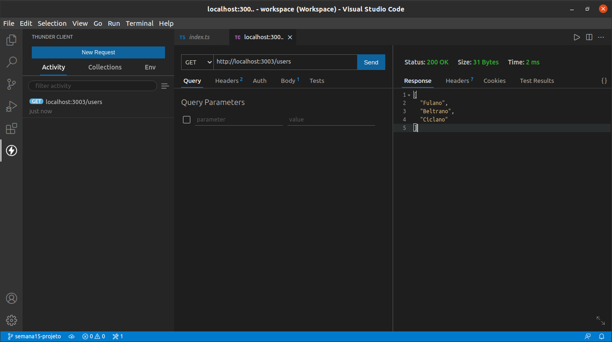
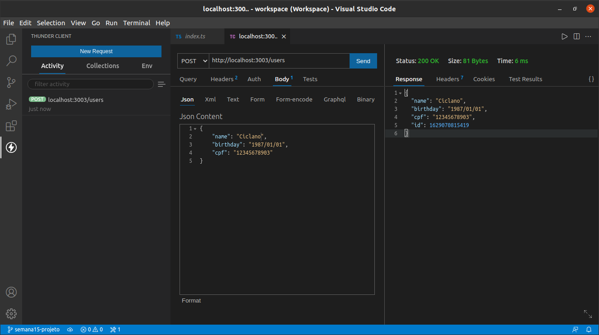
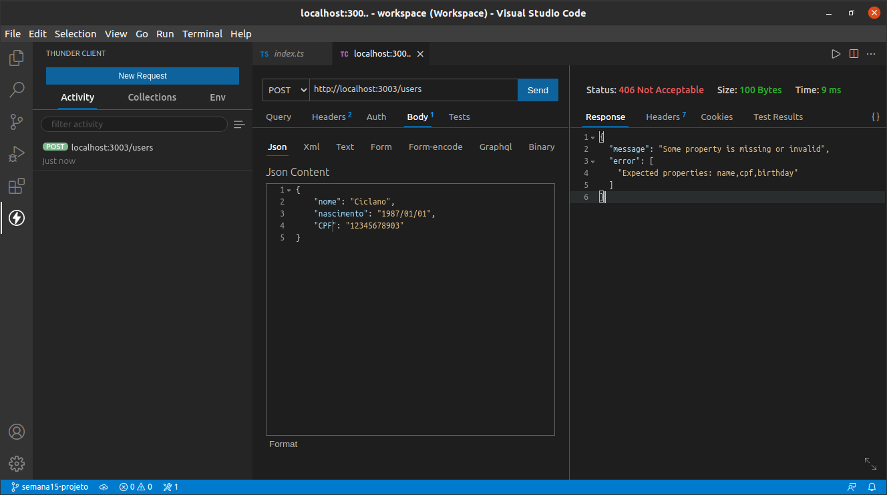
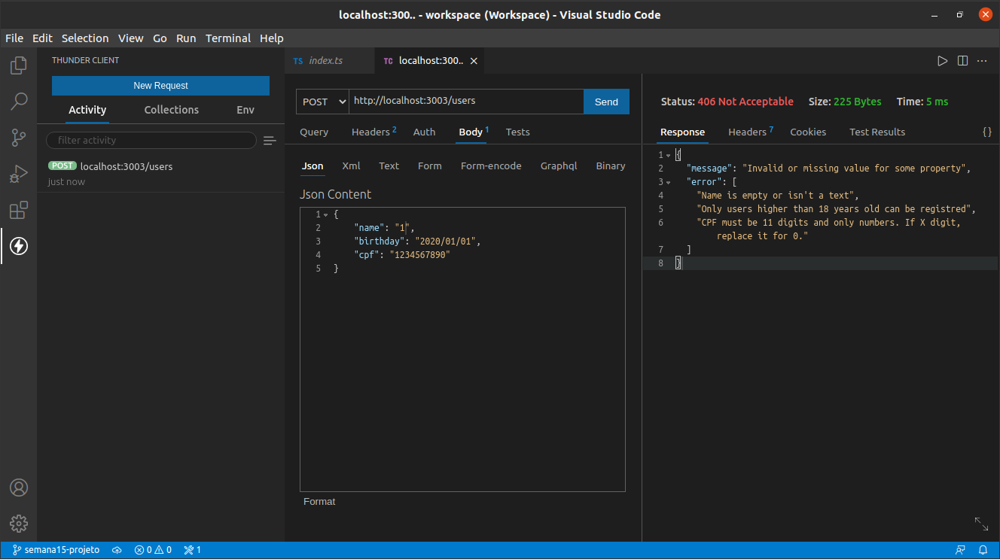

### LabeBank

### O que funciona
- Requisitos mínimos:
    - [x] endpoint post /users para criação de novos usuários
        - endpoint get /users listando todos os usuários cadastrados;
    - [x] Crie um **tipo** para representar uma conta para o usuário
        - type User em types.ts
    - [x] Crie um array global que armazene usuários na aplicação. Caso queira, pode iniciar este array com valores pré-definidos.
        - accountInfoData.ts e accountData.ts
    - [x] Crie mais um **tipo**: para representar as **transações** que serão salvas no extrato
        - type transactions em types.ts
    - [x] Dentro da definição do usuário, crie um array que armazene as transações de um cliente.
        - accountInfoData.ts
    - [x] Crie um endpoint  que utilize o método `POST` da entidade `users` que será responsável por cadastrar um usuário em um array de usuários. Neste momento, não se preocupe, com as validações descritas nas funcionalidades.
        - endpoint post /users que deve receber body {name, birthday e cpf}, com validação de dados
    - [x] Crie um método `GET` na entidade `users` função que será responsável por pegar todos os usuários existentes no array de usuários.
        - endpoint get /users lista os nomes dos usuários registrados
    - [x] Adicione, uma validação no item 1 (Criar conta): o usuário deve possuir mais do que 18 anos para conseguir se cadastrar. Caso não possua, exiba uma mensagem de erro.
        - validação de idade, cpf e nome

### O que não funciona
- Desafios ainda serão realizados

### Link Surge 
n/a

### Imagens
###### ver usuários cadastrados get /users

###### cadastar um novo usuário post /users + body json

###### Exemplo de erro 1: cadastar um novo usuário post /users + body json

###### Exemplo de erro 2: cadastar um novo usuário post /users + body json
